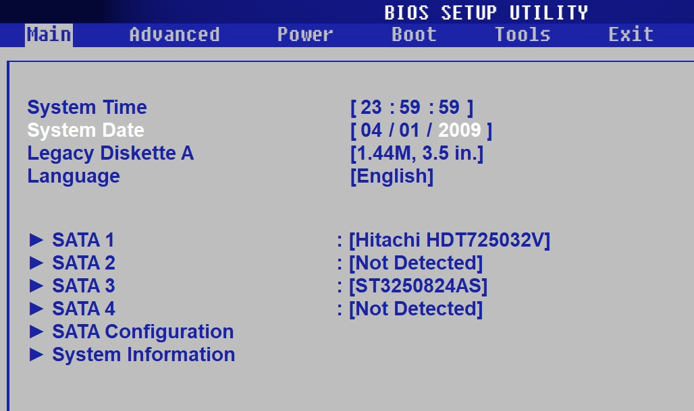
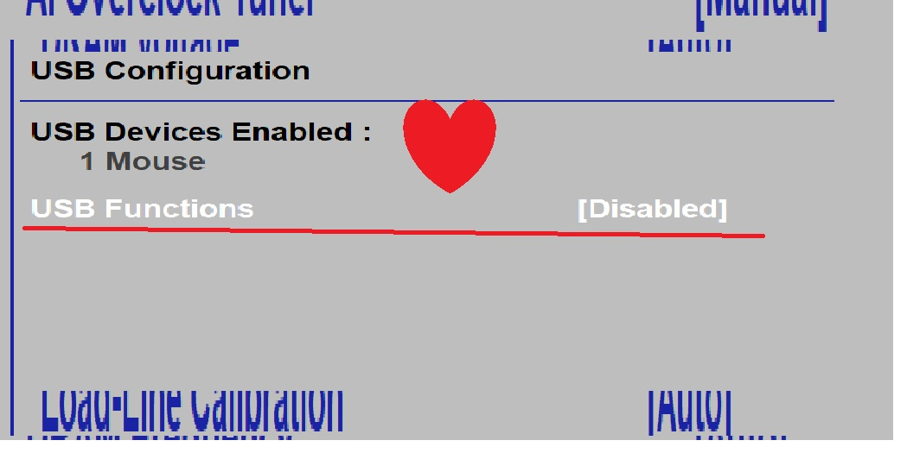
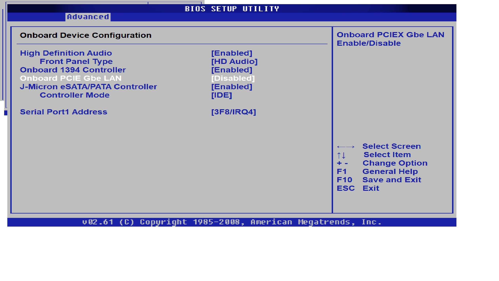
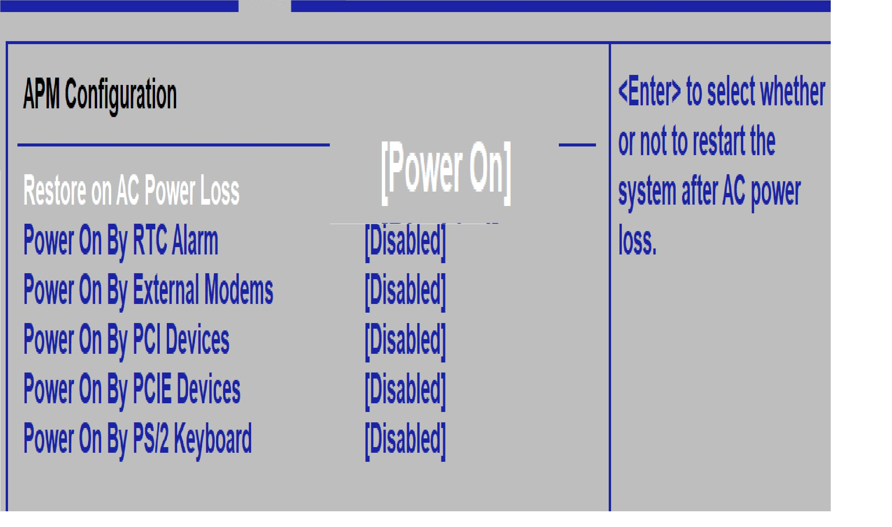
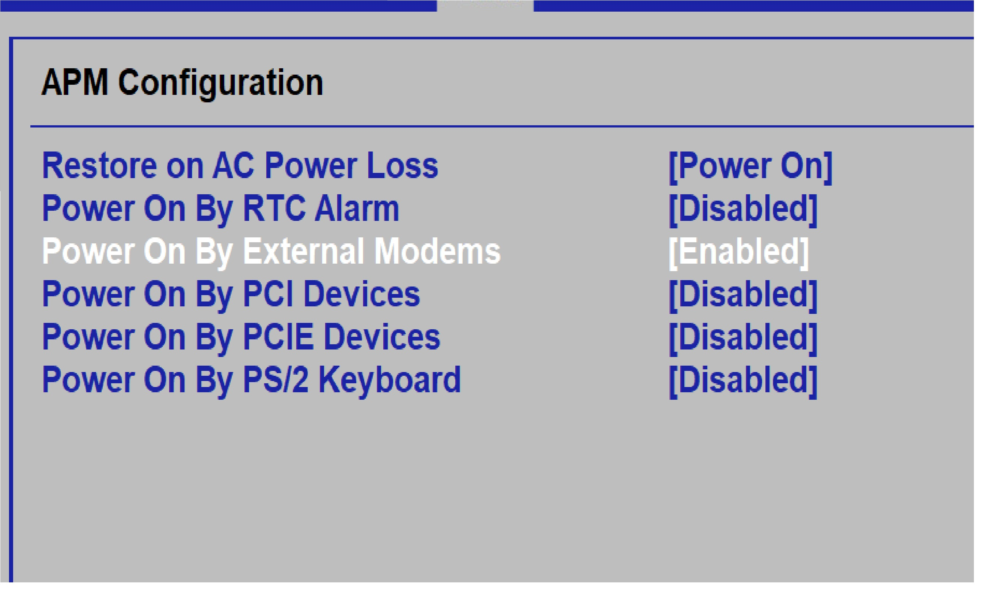
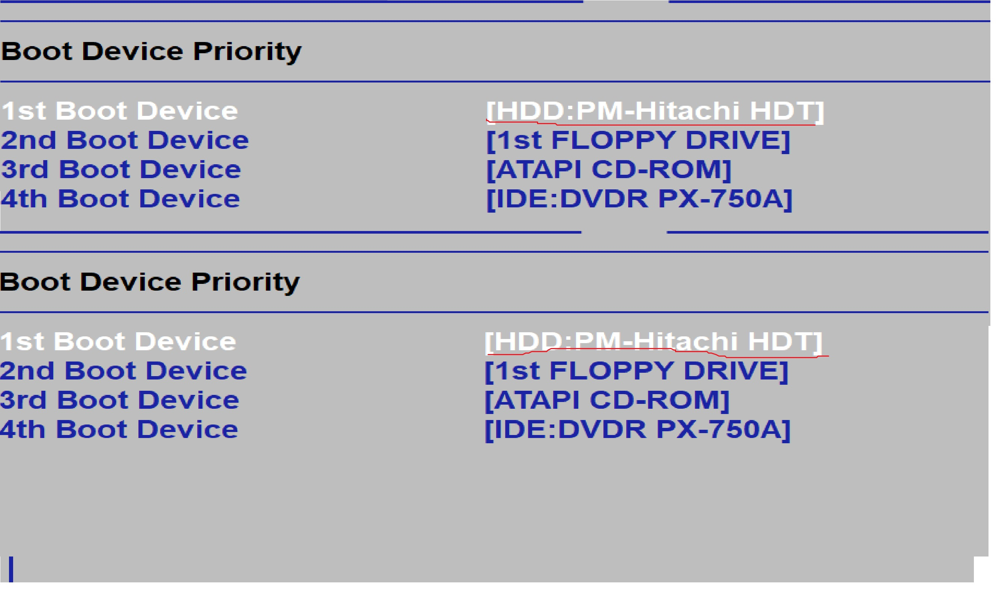
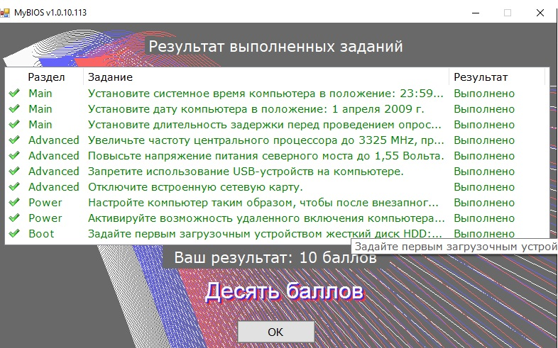

# Лабораторная работа №12

## Тема: Конфигурирование BIOS Setup Utility

**Выполнил:** Евгений Белевитин

---

## Цель работы

Отработка навыков настройки параметров BIOS для оптимизации работы системы, разгона процессора и управления периферийными устройствами.

---

## Задание №1: Установка системного времени

**Описание:** Установить системное время в положение 23:59:59. Данная настройка позволяет вручную скорректировать время на системных часах компьютера.

**Раздел BIOS:** Main → System Time

**Результат:** 
---

## Задание №2: Установка системной даты

**Описание:** Установить дату на 1 апреля 2009 г. Корректировка системной даты необходима для правильной работы приложений, использующих временные метки.

**Раздел BIOS:** Main → System Date

**Результат:** 

---

## Задание №3: Настройка задержки опроса SATA-устройств

**Описание:** Установить длительность задержки перед опросом SATA-устройств равную 20 секундам. Эта настройка полезна при использовании старых или медленных жестких дисков, которым требуется дополнительное время для выхода на рабочий режим.

**Раздел BIOS:** Main → SATA Configuration → Hard Disk Pre-Delay

**Результат:** 

---

## Задание №4: Разгон центрального процессора

**Описание:** Увеличить частоту ЦП до 3325 MHz (FSB 350 MHz) при неизменном множителе 9.5. Разгон процессора позволяет повысить производительность системы за счет увеличения тактовой частоты.

**Раздел BIOS:** Advanced → JumperFree Configuration → FSB Frequency

**Результат:** 

---

## Задание №5: Настройка напряжения северного моста

**Описание:** Повысить напряжение питания северного моста до 1,55 Вольта. Увеличение напряжения северного моста требуется для обеспечения стабильной работы системы при разгоне процессора и оперативной памяти.

**Раздел BIOS:** Advanced → JumperFree Configuration → North Bridge Voltage

**Результат:** 

---

## Задание №6: Отключение USB-контроллера

**Описание:** Запретить использование USB-устройств на компьютере. Отключение USB-контроллера может потребоваться в целях информационной безопасности для предотвращения подключения внешних накопителей.

**Раздел BIOS:** Advanced → USB Configuration → USB Functions → Disabled

**Результат:** 

---

## Задание №7: Отключение встроенной сетевой карты

**Описание:** Отключить встроенную сетевую карту (LAN). Данная настройка используется при выходе из строя встроенной сетевой карты или для изоляции компьютера от сети.

**Раздел BIOS:** Advanced → Onboard Devices Configuration → Onboard PCIE Gbe LAN → Disabled

**Результат:** 

---

## Задание №8: Настройка поведения при потере питания

**Описание:** Автоматическое включение ПК после внезапного исчезновения и восстановления сети. Эта функция необходима для серверов и компьютеров, работающих в автоматическом режиме без участия оператора.

**Раздел BIOS:** Power → APM Configuration → Restore on AC Power Loss → Power On

**Результат:** 

---

## Задание №9: Активация удаленного включения (Wake-on-Modem)

**Описание:** Активировать возможность включения ПК сигналом от модема из режима Soft Off. Функция позволяет удаленно включать компьютер через телефонную линию при подключенном модеме.

**Раздел BIOS:** Power → APM Configuration → Power On By External Modem → Enabled

**Результат:** 

---

## Задание №10: Приоритет загрузки жесткого диска

**Описание:** Задать первым загрузочным устройством жесткий диск HDD:PM-Hitachi HDT. Настройка порядка загрузки определяет, с какого устройства система будет загружаться в первую очередь.

**Раздел BIOS:** Boot → Boot Device Priority → 1st Boot Device

**Результат:** 

---

## Итоговый результат

**Финальный скриншот с подтверждением выполнения всех заданий:**

---

## Вывод

В ходе выполнения лабораторной работы я научился настраивать основные параметры BIOS: системное время и дату, задержку опроса SATA-устройств, выполнил разгон процессора с повышением напряжения северного моста, отключил USB-контроллер и встроенную сетевую карту, настроил поведение при потере питания и приоритет загрузки устройств.